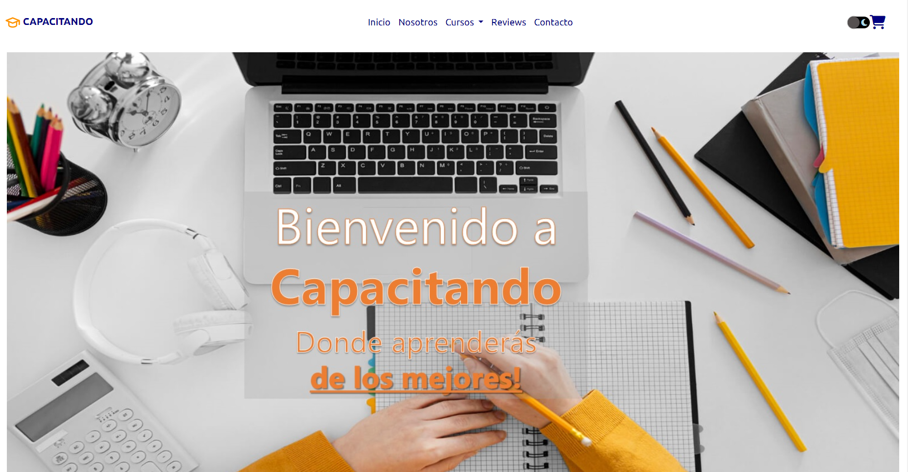

 
<h1> Proyecto Final - Curso JavaScript Comision 48575 CoderHouse </h1>

En el desarrollo de este proyecto final se aplicaron las siguientes herramientas:

:heavy_check_mark:HTML5

:heavy_check_mark:Bootstrap

:heavy_check_mark:CSS3

:heavy_check_mark:SASS

:heavy_check_mark:GitHub

:heavy_check_mark:GitHub Pages

<h1> :warning: JavaScript</h1>

:white_check_mark:Declaraciones de variables locales y globales.

:white_check_mark:Condicionales, bucles.

:white_check_mark:Objetos y arrays.

:white_check_mark:Metodos de Arrays.

:white_check_mark:Manipulacion del DOM.

:white_check_mark:Operadores Avanzados.

:white_check_mark:Carga de datos desde una API o Archivo JSON.

:white_check_mark:Manipulacion del LocalStorage.

:white_check_mark:Uso de librerias: Se usaron Toastify y SweetAlert.

:white_check_mark:Creacion de funciones.

:white_check_mark:Uso de una clase constructora para la creacion de objetos.

:white_check_mark:Uso de eventos click.

:white_check_mark:Uso de funciones asincronicas y promesas con fetch

<h1>Descripcion del Proyecto</h1>

El proyecto consiste en una Ecommerce de venta de diferentes cursos, existe una seccion de cursos destacados y una seccion donde se muestra el catalogo completo las cuales tomaran unos 3 segundos en cargarse.

<h2>Cursos cargados en la seccion Cursos Destacados</h2>

Esta seccion de cursos destacados se cargara mediante un archivo JSON el cual consta de toda la base de datos de los cursos existentes, este array constara de 4 objetos que se cargaran aleatoriamente cada vez que se actualice la pagina.

<h2>Seccion Catalogo de Cursos</h2>

Como se menciono anteriormente tenemos la seccion catalogo donde se mostraran todos los cursos.

En esta seccion se van a mostrar todos los cursos del archivo JSON en forma de cards, disponemos de una serie de botones a mano izquierda llamados Programacion, Diseño y Data que corresponde a las categorias de cursos disponibles.
Al seleccionar cada boton se le agrega una clase "Active" que hace que el boton cambie de color y muestre los cursos correspondiente a la categoria seleccionada.

Muestra de como se ve la categoria seleccionada:

Asi mismo estan los botones de ordenamiento que sirven para ordenar los cursos de mayor a menor precio, de menor a mayor precio y por orden alfabetico.

Desde el catalogo de cursos, cada card de curso tiene un boton de agregar al carro que cuando hagas click en el y el curso no este agregado al carro de compras mostrara la siguiente notificacion:

de lo contrario si el curso esta agregado mostrara la siguiente alerta:

  

<h2>Carro de Compras</h2>

En la barra de navegacion junto al boton del modo oscuro se puede observar el carro de compras, al estar vacio el carro de compras figurara de la siguiente manera:

  

al momento de haber agregado un curso el mismo aparecerea de la siguiente forma:

  

Cuando el carro esta cargado con cursos se podran observar todos los agregados y el monto total de la compra.

Para realizar la compra siempre y cuando el carro este con algun curso agregado hacer click en confirmar compra y se mostrara la siguiente alerta:

  

de lo contrario si no hay algun curso agregado se mostrara la siguiente alerta:

  

<h2>Realizar Compra</h2>

habiendo agregando al menos un curso al carro de compras hacer click donde dice confirmar compra, volver a hacer click donde dice "Si, Confirmar" y se mostrara la siguiente alerta donde indica que se realizo la compra:

  

 Espero que este archivo te ayude a entender un poco mas de mi proyecto
