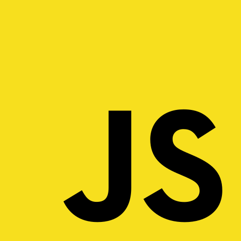

<h1> Proyecto Final - Curso JavaScript Comision 48575 CoderHouse </h1>

En el desarrollo de este proyecto final se aplicaron las siguientes herramientas: 

  :heavy_check_mark:HTML5
  
  :heavy_check_mark:Bootstrap
  
  :heavy_check_mark:CSS3
  
  :heavy_check_mark:SASS
  
  :heavy_check_mark:GitHub
  
  :heavy_check_mark:GitHub Pages

<h1>:warning: JavaScript</h1>

:white_check_mark:Declaraciones de variables locales y globales.

:white_check_mark:Condicionales, bucles.

:white_check_mark:Objetos y arrays.

:white_check_mark:Metodos de Arrays.

:white_check_mark:Manipulacion del DOM.

:white_check_mark:Operadores Avanzados.

:white_check_mark:Carga de datos desde una API o Archivo JSON.

:white_check_mark:Manipulacion del LocalStorage.

:white_check_mark:Uso de librerias: Se usaron Toastify y SweetAlert.

:white_check_mark:Creacion de funciones.

:white_check_mark:Uso de una clase constructora para la creacion de objetos.

:white_check_mark:Uso de eventos click. 

:white_check_mark:Uso de funciones asincronicas y promesas con fetch

<h1>Descripcion del Proyecto</h1>

El proyecto consiste en una Ecommerce de venta de cursos donde se podra observar una seccion donde se cargara un array (median un archivo JSON) de 4 articulos aleatorios que cambiaran cada vez que se actualice la pagina. 

Luego tenemos una seccion del catalogo de corsos donde se tomara 3 segundos la carga de todo el catalago.

En esta seccion se van a mostrar todos los cursos del archivo JSON en forma de cards, disponemos de una serie de botones a mano izquierda llamados Programacion, Diseño y Data que corresponde a las categorias de cursos disponibles.
Al seleccionar cada boton se le agrega una clase "Active" que hace que el boton cambie de color y muestre los cursos correspondiente a la categoria seleccionada. 
